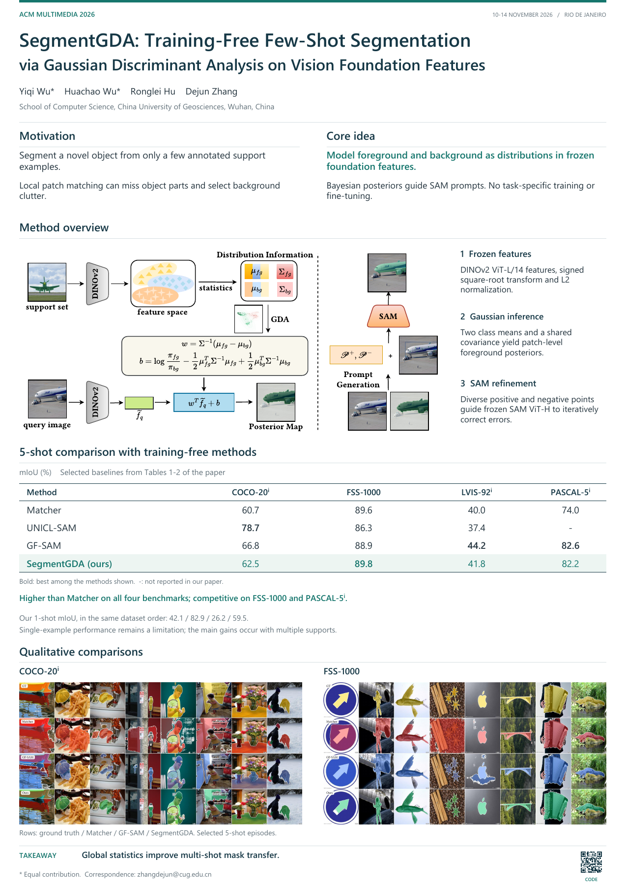

# SegmentGDA Conference Poster

ACM Multimedia 2026 英文论文海报，A0 竖版（841 × 1189 mm）。

论文：**SegmentGDA: Training-Free Few-Shot Segmentation via Gaussian Discriminant Analysis on Vision Foundation Features**。

作者：Yiqi Wu、Huachao Wu、Ronglei Hu、Dejun Zhang。单位：China University of Geosciences, Wuhan。

## 最新版本

- [第四版印刷 PDF](output/SegmentGDA_ACMMM2026_A0_v4.pdf)
- [第四版可编辑 SVG](output/SegmentGDA_ACMMM2026_A0_v4_editable.svg)
- [制作与印刷说明](output/制作与印刷说明.md)
- [第四版调整说明](output/第四版调整说明.md)



## 目录

- `output/`：历版海报、预览和说明；推荐使用带 `v4` 的文件。第四版优化字体与排版，沿用第三版的基线对比和实验内容，保留原论文方法图。
- `source/`：生成脚本及论文图像素材。
- `3767308.3835710.pdf`：海报内容对应的论文。

## 重新生成

依赖 Python、ReportLab、pypdf、Pillow，以及 Poppler 的 `pdftocairo`。第四版使用 Windows 的 `C:/Windows/Fonts/segoeui.ttf` 和 `seguisb.ttf`；其他系统需调整字体路径。编辑 SVG 时也需安装对应的 Segoe UI 字体；PDF 已嵌入使用的字体子集。

```sh
python -m pip install reportlab pypdf pillow
python source/build_poster_v4.py
```

脚本从原论文提取素材，输出 PDF 和 SVG。预览可使用 Poppler 生成：

```sh
pdftoppm -scale-to 1800 -singlefile -png output/SegmentGDA_ACMMM2026_A0_v4.pdf output/SegmentGDA_ACMMM2026_preview_v4
```

## 参考

- [论文 DOI](https://doi.org/10.1145/3767308.3835710)
- [论文代码](https://github.com/wavachao/SegmentGDA)
- [ACM MM 2026 官方印刷说明](https://2026.acmmm.org/site/poster-printing-service.html)
- [排版参考：Moby 海报](https://henryhxu.github.io/share/moby/moby_poster.pdf)

参考海报仅用于研究版式，不包含在本仓库中。论文与原图的权利归原作者所有。
